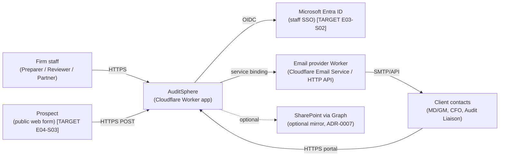
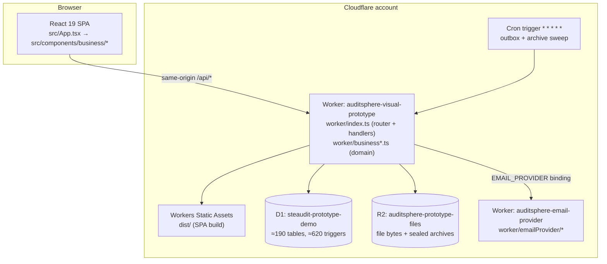

# Architecture Overview

Status: **current state verified at `main@54ec5a3`**; *target* deltas are marked **[TARGET]** and delivered by the epic shown.

## 1. C4 Level 1 — System context

## 2. C4 Level 2 — Containers

**[TARGET E02-S01]** Two environments (`staging`, `production`) each with their own Worker, D1, R2, email provider and secrets; `workers_dev: false` in production; custom domain.

## 3. Where data lives

| Data | Store | Notes |
|---|---|---|
| All structured business records | D1 (SQLite) | Normalised tables, FK + CHECK + immutability triggers. Single source of truth. |
| File bytes (uploads, generated PDFs/DOCX/XLSX, archives) | R2 | SHA-256 verified on commit; `file_versions` in D1 holds metadata. Sealed archives under retention-specific prefixes with R2 lock rules (`worker/r2-archive-locks.json`). |
| Async work | D1 `outbox_jobs` | Kinds `EMAIL, GENERATE_DOCUMENT, IMPORT_TB, SEAL_ARCHIVE, VERIFY_FILE`; processed by the minute cron (`processBusinessOutbox`). |
| Audit history | D1 `audit_events` + `audit_chain_heads` | Append-only, hash-chained. |
| Browser | `localStorage` via `src/services/businessWorkspace.ts` | Only workspace ID + selected actor/scope. **[TARGET E03]** Only workspace ID; actor comes from the session cookie. |
| Retired (E01-S05 / migration 0045) | Legacy TEST snapshot tables removed; `demo_seeds` is retained read-only because `workspaces.seed_id` references it. | No runtime BUSINESS dependency. |

## 4. Request path (current)

1. SPA calls `/api/workspaces/:workspaceId/...` with headers `X-Actor-Id`, `X-Active-Persona`, optional `X-Client-Id`, `X-Engagement-Id`.
2. `worker/index.ts` router → handler.
3. Reads: handler → `getBusiness*` in a `worker/business*.ts` module → `resolveBusinessContext(env, workspaceId, request)` (43 call sites) → SQL.
4. Writes: `POST …/commands` with `Idempotency-Key` → `parseBusinessCommandEnvelope` → `runBusinessDirectoryCommand` → per-module builder returns `D1PreparedStatement[]` → executed as one `batch` (atomic) with `command_receipts`, `audit_events`, change-feed rows.
5. Async follow-up via `outbox_jobs`.

**[TARGET E03-S03]** Step 1 sends only the session cookie (+ optional scope headers). `resolveBusinessContext` derives the actor from `auth_sessions.active_actor_profile_id`; `X-Actor-Id`/`X-Active-Persona` and `envelope.actor` are rejected if they disagree, then removed (E03-S08).

## 5. Module map (code)

| Spec module | Worker module(s) | UI panel |
|---|---|---|
| M1 Commercial & CRM | `worker/business.ts` (directory, leads, proposals), `worker/businessDelivery.ts` (EL, invoices, payments), `worker/proposalDocument.ts`, `worker/commercialDocument.ts` | `BusinessWorkspace.tsx`, `BusinessDeliveryPanel.tsx` |
| M2 Governance & Planning | `worker/businessRisk.ts`, `worker/businessPlanning.ts`, `worker/businessTb.ts` (TB, mapping, materiality) | `BusinessAcceptanceRiskPanel.tsx`, `BusinessPlanningPanel.tsx`, `BusinessTrialBalancePanel.tsx` |
| M3 Fieldwork | `worker/businessFieldwork.ts` | `BusinessFieldworkPanel.tsx`, `ProcedureConflictReview.tsx` |
| M4 Reporting & Archive | `worker/businessReporting*.ts`, `worker/reporting*.ts`, `worker/streamingArchive.ts`, `worker/archiveRetention.ts` | `BusinessReportingPanel.tsx` |
| M5 Practice | `worker/businessPractice.ts`, `src/services/practiceAccounts.ts` | `BusinessPracticePanel.tsx` |
| PBC Portal | `worker/business.ts` (`getBusinessPbcPortal`, files) | `BusinessPbcPanel.tsx` |
| Workflow progress | `worker/businessWorkflow.ts` | `BusinessWorkflowProgress.tsx` |
| Async | `worker/businessOutbox.ts`, `worker/businessReportingJobs.ts` | — |
| Integrations | `worker/emailProvider/*`, `worker/integrations/sharepoint.ts`, `worker/integrations/status.ts` | — |
| **[TARGET E03]** Auth | `worker/auth/*` (new) | `src/components/auth/*` (new) |

## 6. Tech stack — pinned versions

Versions are pinned exactly in `package.json` and resolved by `package-lock.json`. Do not upgrade any of these without an ADR.

| Layer | Package / platform | Version |
|---|---|---|
| Runtime (CI + local) | Node.js | 24 (`.nvmrc`), `engines: node >=24, npm >=11` |
| Language | TypeScript | 7.0.2 |
| UI | React / React DOM | 19.3.0 |
| Build | Vite / @vitejs/plugin-react | 8.3.0 / 6.1.1 |
| Edge runtime tooling | Wrangler | 4.147.0 |
| Worker compat | `compatibility_date` / flags | `2026-09-30` / `nodejs_compat` |
| Validation | zod | 4.6.5 |
| Hashing | @noble/hashes | 2.2.0 |
| PDF | jspdf | 4.2.1 |
| DOCX | docx | 9.7.1 |
| XLSX parsing | xlsx (SheetJS CE) | 0.18.5 |
| Zip / streaming | fflate | 0.8.3 |
| TS runner (tests/tools) | tsx | 4.23.15 |
| Test runner | `node:test` (built-in) | Node 24 |
| Test DB | `node:sqlite` via `tests/helpers/sqliteD1.ts` | Node 24 |
| Browser E2E | Chrome over CDP, `tests/helpers/headlessChrome.ts` | system Chrome (`CHROME_PATH`) |

Not used and **must not be introduced**: Next.js, Prisma, Postgres, Tailwind, Redux/Zustand, Playwright/Cypress, any ORM. (They exist only inside `ste-audit/`, which E01-S01 deletes.)

## 7. Scheduled processing

`worker/index.ts` `scheduled()` runs every minute: queue due archives → process outbox → purge expired sessions/idempotency keys → **(legacy, delete in E01-S02)** TEST-workspace expiry and `demo_*` cleanup → emit metrics; logs `workspace.archive.overdue` at error severity.

## 8. Integration posture

| Integration | State | Readiness probe |
|---|---|---|
| Email | Provider Worker deployed with single-recipient UAT allowlist; no real delivery accepted | `GET /api/integrations/status` |
| SharePoint / Graph | Adapter implemented; live token request failing (owner credential action) | same |
| Rate limiter | Code present; **binding absent** → no-op | — |
| Entra ID (auth) | **[TARGET E03-S02]** | — |
