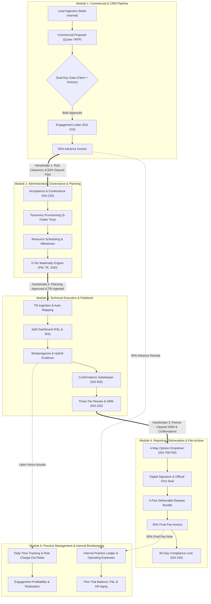
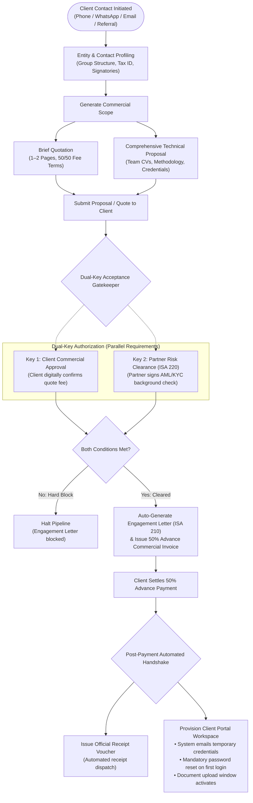
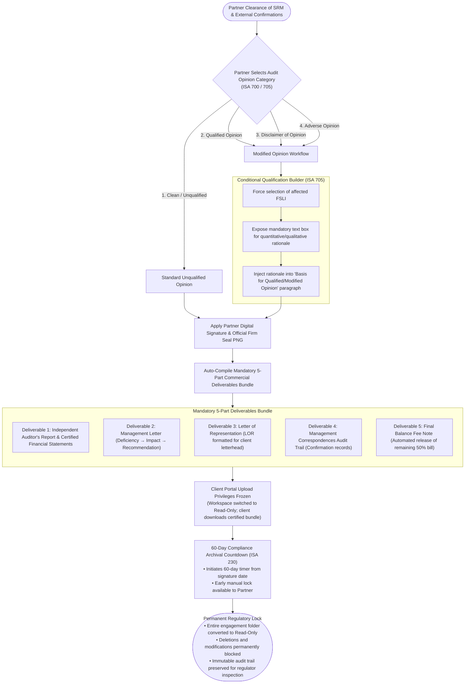
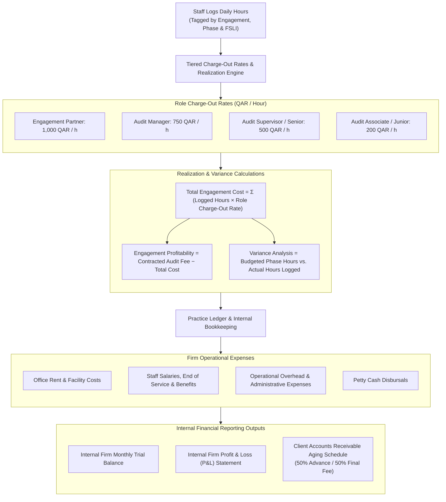
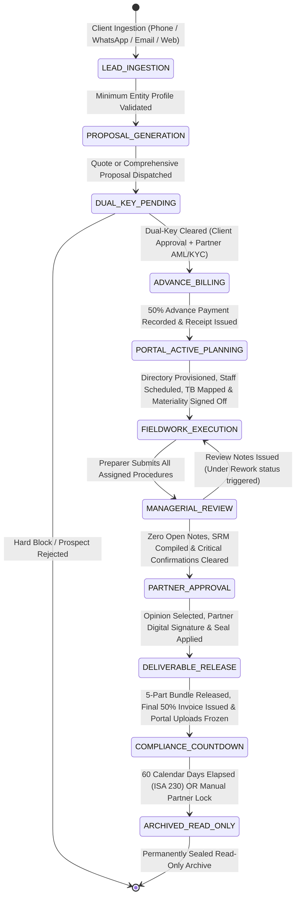

# STE Audit Management Tool

## Functional Requirements & End-to-End System Workflow Specification

| Attribute | Specification Details |
| :--- | :--- |
| **Document Version** | 2.1 |
| **Document Status** | `CURRENT` |
| **Target Focus** | Business Logic, Functional Requirements, Task Sequences & Module Workflows |
| **Auditing Standards Context** | International Standards on Auditing (ISA) & International Financial Reporting Standards (IFRS) |
| **Primary Currency** | Qatari Riyal (QAR) |
| **System Architecture** | Modular Monolith (ASP.NET Core / Blazor Interactive Server / PostgreSQL) |

---

## Executive Table of Contents

- [1. Requirement Gathering & Operational Context](#1-requirement-gathering--operational-context)
  - [1.1 Business Objectives & Problem Statement](#11-business-objectives--problem-statement)
  - [1.2 User Personas & Responsibility Matrix](#12-user-personas--responsibility-matrix)
- [2. Project Modules Connectivity & Architecture](#2-project-modules-connectivity--architecture)
- [3. End-to-End Project Task Flows & Sequence Maps](#3-end-to-end-project-task-flows--sequence-maps)
  - [3.1 Flow 1: Lead Ingestion to Dual-Key Client Onboarding](#31-flow-1-lead-ingestion-to-dual-key-client-onboarding)
  - [3.2 Flow 2: Planning, Resource Scheduling & Materiality Formulation](#32-flow-2-planning-resource-scheduling--materiality-formulation)
  - [3.3 Flow 3: Technical Fieldwork Execution & Multi-Tier Review Matrix](#33-flow-3-technical-fieldwork-execution--multi-tier-review-matrix)
  - [3.4 Flow 4: Reporting, 5-Part Deliverable Release & Compliance Archive](#34-flow-4-reporting-5-part-deliverable-release--compliance-archive)
  - [3.5 Flow 5: Practice Management, Time Realization & Firm Bookkeeping](#35-flow-5-practice-management-time-realization--firm-bookkeeping)
- [4. Module-by-Module Functional Requirements](#4-module-by-module-functional-requirements)
  - [4.1 Module 1: Commercial & CRM Pipeline](#41-module-1-commercial--crm-pipeline)
  - [4.2 Module 2: Administration, Governance & Planning](#42-module-2-administration-governance--planning)
  - [4.3 Module 3: Technical Execution & Audit Fieldwork](#43-module-3-technical-execution--audit-fieldwork)
  - [4.4 Module 4: Reporting & Final Deliverables](#44-module-4-reporting--final-deliverables)
  - [4.5 Module 5: Practice Analytics & Internal Bookkeeping](#45-module-5-practice-analytics--internal-bookkeeping)
- [5. System State Machine & Lifecycle Transitions](#5-system-state-machine--lifecycle-transitions)
  - [5.1 State Machine Transition Matrix](#51-state-machine-transition-matrix)
  - [5.2 State Machine Visual Workflow](#52-state-machine-visual-workflow)

---

# 1. Requirement Gathering & Operational Context

## 1.1 Business Objectives & Problem Statement

* **Elimination of Per-File Licensing Penalties:** Existing commercial platforms enforce rigid licensing tiers (e.g., limits of 130 client files) that charge steep incremental fees for additional files. The in-house platform must support an unlimited number of client entities, historical engagements, and working papers with zero subscription penalties.
* **Unified Engagement Lifecycle:** Centralize commercial sales, administrative governance, compliance clearance, audit fieldwork execution, multi-tier quality reviews, client deliverable generation, and internal firm practice management into a single, cohesive workflow.
* **Standardized Auditing Governance:** Standardize firm-wide execution in strict alignment with International Standards on Auditing (ISA), including:
  * **ISA 210:** Agreeing the Terms of Audit Engagements (Engagement Letters).
  * **ISA 220 & ISQC 1:** Quality Control for an Audit of Financial Statements (Client Acceptance & Continuance).
  * **ISA 230:** Audit Documentation (60-day assembly and regulatory locking).
  * **ISA 320:** Materiality in Planning and Performing an Audit.
  * **ISA 505:** External Confirmations.
  * **ISA 570:** Going Concern.
  * **ISA 700 & 705:** Forming an Opinion and Reporting on Financial Statements.

---

## 1.2 User Personas & Responsibility Matrix

| User Role | Target Persona | Functional Scope & Core Responsibilities | Key Access Boundary |
| :--- | :--- | :--- | :--- |
| **PREPARER** | Audit Associate / Junior Auditor | • Executes assigned financial statement line item (FSLI) audit test procedures.<br/>• Uploads digital working papers and inputs physical binder index codes (`X-1, Box 3`).<br/>• Submits completed testing packages for managerial review.<br/>• Logs daily operational hours against assigned engagement tasks. | Limited to assigned workprograms; no sign-off or external communication rights. |
| **REVIEWER** | Audit Senior / Audit Manager | • Verifies substantive testing and recalculated schedules.<br/>• Issues inline review notes and initiates the rework loop for incomplete tests.<br/>• Determines sampling parameters and calculates engagement materiality.<br/>• Prepares the Summary Review Memorandum (SRM) for the partner.<br/>• Tracks engagement budgets, team hours, and delivery milestones. | Engagement-wide review; can return tests for rework; cannot sign final audit opinion. |
| **APPROVER** | Engagement Partner | • Evaluates and signs off on the Dual-Key Acceptance Gate (AML/KYC).<br/>• Authorizes commercial proposals and executes Engagement Letters.<br/>• Clears high-risk (Red) audit areas and formally signs off on the SRM.<br/>• Selects the final Audit Opinion, applies digital signatures and firm seals.<br/>• Authorizes final deliverable bundles and enforces regulatory file locks. | Full firm and engagement sign-off authority; final gatekeeper for releases. |
| **CLIENT** | Client Coordinator / CFO / MD | • Accesses an isolated, tokenized external workspace (PBC Portal).<br/>• Views requested audit documentation with real-time review status badges.<br/>• Uploads requested financial schedules, trial balances, and voucher evidence.<br/>• Receives invoices, receipts, holding letters, and final deliverables.<br/>• Access freezes automatically upon engagement sign-off. | Isolated tenant portal; read/upload only; access terminates on engagement closure. |

---

# 2. Project Modules Connectivity & Architecture

The five core functional modules communicate across strict data boundaries. An engagement progresses sequentially through gates, ensuring administrative and compliance requirements are met before field testing begins.



---

# 3. End-to-End Project Task Flows & Sequence Maps

## 3.1 Flow 1: Lead Ingestion to Dual-Key Client Onboarding

The onboarding path enforces an automated state machine. An Engagement Letter cannot be generated until commercial terms are accepted by the client and risk clearance is formally approved by the Engagement Partner.



> [!IMPORTANT]
> **Dual-Key Invariant:** Under no circumstances can an Engagement Letter or Client Portal be provisioned without both Key 1 (Client Commercial Acceptance) and Key 2 (Partner AML/KYC Clearance) recorded in the database.

---

## 3.2 Flow 2: Planning, Resource Scheduling & Materiality Formulation

Once an engagement is onboarded, the system initializes project administration, provisions the document structure, assigns staff, and calculates materiality thresholds from Trial Balance benchmarks.

```mermaid
flowchart TD
    DualKeyClear(["Partner Clearance of Dual-Key Gate"]) --> ProvisionDir["Automated Engagement Directory Provisioning<br/>├── 01_Administration & Planning<br/>├── 02_Trial Balance & Schedules<br/>├── 03_Fieldwork & Testing<br/>├── 04_Drafts & Deliverables<br/>└── 05_Final Signed Archive"]

    ProvisionDir --> Scheduling["Resource Scheduling & Assignment<br/>• Allocate Partner (Approver), Manager (Reviewer), Associates (Preparers)<br/>• Configure milestones based on statutory reporting cutoff"]

    Scheduling --> IngestTB["Ingest Client Trial Balance (TB)<br/>(Excel / CSV upload with automated account code mapping)"]

    IngestTB --> MatEngine["3-Tier Materiality Calculation Engine"]

    subgraph MatDetails["Materiality Calculation Engine Steps"]
        direction TB
        BaseSel["1. Benchmark Base Selection<br/>• Profit Before Tax: 5%–10%<br/>• Revenue: 0.5%–2%<br/>• Total Assets: 0.5%–1%<br/>• Equity / Net Assets: 1%–2%"]
        Metrics["2. Compute Core Metrics<br/>• Planning Materiality (PM) = Base × Selected %<br/>• Tolerable Error (TE) = 50%–75% of PM<br/>• SAD Threshold (Trivial) = 3%–5% of PM"]
        Rounding["3. Practical Rounding Tolerance<br/>• Manager may round within strict ±5% limit (e.g., 53,421 → 53,000)"]
        RiskColor["4. Account Risk Stratification<br/>• GREEN = Balance < TE (Low Risk: Junior Auditor)<br/>• AMBER = TE < Balance < PM (Moderate Risk: Senior)<br/>• RED = Balance > PM or High Inherent Risk (Critical: Manager/Partner)"]
        BaseSel --> Metrics --> Rounding --> RiskColor
    end

    MatEngine --> MatDetails
    MatDetails --> SignOff(["Formal Partner Sign-Off on Planning & Materiality"])
```



### 3-Tier Materiality Thresholds & Stratification Guide

| Materiality Metric | Benchmark Formula / Percentage | Operational Purpose |
| :--- | :--- | :--- |
| **Planning Materiality (PM)** | Benchmark Base × Chosen % (e.g., PBT 5–10%, Revenue 0.5–2%, Assets 0.5–1%) | Maximum misstatement threshold before financial statements are considered materially misstated. |
| **Tolerable Error (TE) / Performance Materiality** | 50% (High Inherent Risk) to 75% (Low Inherent Risk) of PM | Working threshold used to determine sample sizes and identify individual line items requiring substantive testing. |
| **Summary of Audit Differences (SAD)** | 3% to 5% of PM | Trivial threshold below which misstatements do not need to be accumulated on the audit difference schedule. |
| **Practical Rounding Rule** | Strict ±5% adjustment limit | Managers may round raw values for operational practicality (e.g., QAR 53,421 rounded to QAR 53,000) before Partner sign-off. |

---

## 3.3 Flow 3: Technical Fieldwork Execution & Multi-Tier Review Matrix

This phase constitutes the operational testing core. Line items on the Financial Statement Dashboard launch dedicated workprograms with row-level concurrency, allowing team members to execute testing in parallel without file lockout.

```mermaid
flowchart TD
    PlanApproved(["Partner Sign-Off on Planning & Materiality"]) --> SplitView["Split Financial Statement Dashboard View"]

    subgraph DashboardView["Split Dashboard Interface (Row-Level Concurrency)"]
        direction TB
        PL["PROFIT & LOSS (P/L) STATEMENT<br/>• Revenue / Sales ......... [AR Test] [Audit Workprogram]<br/>• Cost of Goods Sold ..... [AR Test] [Audit Workprogram]<br/>• Operating Expenses ..... [AR Test] [Audit Workprogram]"]
        BS["BALANCE SHEET (B/S) STATEMENT<br/>• PPE & Intangibles ...... [AR Test] [Audit Workprogram]<br/>• Inventory .............. [AR Test] [Audit Workprogram]<br/>• Accounts Receivable .... [AR Test] [Audit Workprogram]<br/>• Cash & Bank Equivalents  [AR Test] [Audit Workprogram]"]
    end

    SplitView --> DashboardView

    DashboardView --> LaunchAR["[Launch Analytical Review (AR)]<br/>• Multi-period variance calculation<br/>• Plausibility & ratio assessment<br/>• ISA 570 Going Concern evaluation"]
    DashboardView --> LaunchWP["[Launch Substantive Workprogram]<br/>• Pre-configured procedural checklist<br/>• Ad-hoc custom step injection<br/>• Population & sampling calculators (MUS / Stratified)<br/>• Hybrid evidence cross-referencing:<br/>  - Digital file attachment<br/>  - Physical binder index: [X-1, Box 3]"]

    LaunchAR --> Preparer["PREPARER (Junior Auditor)<br/>Executes test steps, attaches evidence, submits workpackage"]
    LaunchWP --> Preparer

    Preparer --> SubmitReview["Submit for Review"]

    subgraph ReviewMatrix["Three-Tier Review Matrix & Rejection Loop"]
        direction TB
        MgrReview["REVIEWER (Audit Senior / Manager)<br/>Verifies substantive testing and recalculations"]
        Decision{"Review Assessment"}
        ReworkAction["Return with Mandatory Comments<br/>(Status reverts to 'Under Rework')"]
        PromoteAction["Promote & Clear Procedures"]

        MgrReview --> Decision
        Decision -->|"Exceptions / Incomplete"| ReworkAction
        Decision -->|"Passed"| PromoteAction
    end

    SubmitReview --> MgrReview
    ReworkAction -->|"Reassigned for Rework"| Preparer

    PromoteAction --> SRM["Compile Summary Review Memorandum (SRM)<br/>• Aggregates unadjusted audit differences against SAD<br/>• Compiles open risks, AJEs, and critical estimates<br/>• Manager recommendation for sign-off"]

    SRM --> ConfGate{"External Confirmations Gatekeeper (ISA 505)<br/>Check Bank, AR, AP, and Legal Statuses"}

    ConfGate -->|"Critical Confirmation Missing"| HoldingBlock["BLOCK Final Report Release<br/>Trigger Automated 'Holding Letter' to Client"]
    ConfGate -->|"All Critical Confirmations Cleared"| PartnerReview["APPROVER (Engagement Partner)<br/>• Inspects SRM and evaluates unadjusted differences<br/>• Mandatory direct review of RED risk areas<br/>• Clears fieldwork completion"]
```



### Split Financial Statement Dashboard Schematic

```
┌────────────────────────────────────────────────────────────────────────────────────────────────────────┐
│                                 SPLIT FINANCIAL STATEMENT DASHBOARD                                    │
├────────────────────────────────────────────────────────────────────────────────────────────────────────┤
│ PROFIT & LOSS (P/L) STATEMENT                               CY (QAR)     PY (QAR)   Var (%)   Actions  │
│ • Revenue / Sales .......................................  4,520,000    3,890,000   +16.2%    [AR] [WP]│
│ • Cost of Goods Sold .................................... (2,810,000)  (2,450,000)  +14.7%    [AR] [WP]│
│ • Operating Expenses ....................................   (940,000)    (810,000)  +16.0%    [AR] [WP]│
├────────────────────────────────────────────────────────────────────────────────────────────────────────┤
│ BALANCE SHEET (B/S) STATEMENT                               CY (QAR)     PY (QAR)   Var (%)   Actions  │
│ • Property, Plant & Equipment (PPE) .....................  1,850,000    1,920,000    -3.6%    [AR] [WP]│
│ • Inventory .............................................    720,000      610,000   +18.0%    [AR] [WP]│
│ • Accounts Receivable ...................................  1,140,000      980,000   +16.3%    [AR] [WP]│
│ • Cash & Bank Equivalents ...............................    890,000      740,000   +20.3%    [AR] [WP]│
└────────────────────────────────────────────────────────────────────────────────────────────────────────┘
  Legend: [AR] = Launch Analytical Review Interface | [WP] = Launch Substantive Workprogram
```

---

## 3.4 Flow 4: Reporting, 5-Part Deliverable Release & Compliance Archive

Following Partner clearance of the SRM and confirmations, the engagement moves to formal closure. The Partner selects the opinion, embeds credentials, and releases the deliverables bundle alongside the final invoice.



---

## 3.5 Flow 5: Practice Management, Time Realization & Firm Bookkeeping

In parallel with client engagements, the platform captures operational actuals, calculates realization metrics, and maintains the firm's internal practice ledger.



---

# 4. Module-by-Module Functional Requirements

## 4.1 Module 1: Commercial & CRM Pipeline

### 4.1.1 Lead Capture & Client Profiles

* **Multi-Channel Ingestion:** Ingest leads across Phone, WhatsApp, Email, Web Forms, and In-Person Referrals.
* **Corporate Hierarchy:** Maintain organizational trees covering Holdings, Subsidiaries, and Affiliated Entities.
* **Role-Based Communication Routing:** Maintain a Multi-Contact Directory with explicit notification routing:
  * **Managing Director / General Manager:** Recipient of Commercial Proposals, Engagement Letters, and final audit deliverable packages.
  * **Chief Financial Officer / Finance Director:** Recipient of Commercial Invoices, Payment Receipts, and Fee Notes.
  * **Chief Accountant / Audit Liaison:** Recipient of operational PBC (Provided by Client) document requests and confirmation tracking.

### 4.1.2 Commercial Proposal Engine

* **Brief Quotation (RFQ/RFP):** Output a 1–2 page standardized summary showing engagement scope, statutory period, professional fees, payment terms (50% advance / 50% upon draft report), and estimated execution timeline.
* **Comprehensive Proposal:** Auto-compile a multi-page professional presentation incorporating:
  1. Firm Profile, History, and Commercial Registrations.
  2. Assigned Engagement Partner & Audit Team CVs.
  3. Industry-specific Credentials and Portfolio Evidence.
  4. Audit Methodology Overview (ISA compliance framework).
  5. Fee Schedule, Milestone Deliverables, and Execution Timeline.

### 4.1.3 Dual-Key Onboarding Gatekeeper

The system shall strictly disallow the generation of an Engagement Letter until two independent authorization keys are marked active in the database:
* **Key 1 (Commercial Approval):** Recorded confirmation of client quote acceptance.
* **Key 2 (Risk Clearance):** Partner completion and digital sign-off of the Client Acceptance/Continuance Checklist (ISA 220).

### 4.1.4 Engagement Letter Generation (ISA 210)

* **Template Selection:** Automatically pull standardized templates based on engagement type:
  * External Statutory Audit Template (ISA 210).
  * Internal Audit / Agreed-Upon Procedures Template (ISRS 4400).
* **Minimal Manual Input:** Pre-populate from entity profile; require minimal manual field input (Client Legal Name, Period Covered, Agreed Fee, Submission Deadlines).
* **Partner Authorization:** Apply Partner digital stamp and signature upon generation.

### 4.1.5 Advance Invoicing, Receipting & Portal Onboarding

* **Advance Invoicing:** Generate the 50% Advance Invoice concurrently with the Engagement Letter.
* **Payment Recording:** Record payment settlement with transaction reference data (cheque number, bank transfer reference code).
* **Automated Receipt Generation:** Instantly compile and dispatch an official payment receipt voucher to the client upon recording payment.
* **Automated Client Portal Provisioning:**
  * Auto-generate an isolated workspace for the client.
  * Email temporary access credentials to the designated Client Audit Liaison.
  * Enforce mandatory password reset on first login before document submission features are unlocked.
  * Surface real-time status badges on requested items: `Pending Upload`, `Under Review`, `Approved`, `Rejected / Re-upload Required`.
  * **Mandatory Rejection Reason:** If an item is rejected, the auditor must enter a mandatory rejection reason that surfaces immediately on the client's screen.
  * **Temporal Lock:** Client document upload privileges automatically freeze when the final audit report is released.

---

## 4.2 Module 2: Administration, Governance & Planning

### 4.2.1 Dual-Track Acceptance & Continuance Risk Gatekeeper

* **Track A: New Client Acceptance Path:**
  * Mandatory questionnaires: Ultimate Beneficial Ownership (UBO), Anti-Money Laundering (AML) background check, Know Your Customer (KYC) documentation, assessment of management integrity, financial viability evaluation, independence and conflict of interest checks.
* **Track B: Recurring Client Continuance Path:**
  * Delta review checklist: Settlement of prior-year professional fees, key management or shareholding changes, substantial new credit facilities or loans, ongoing litigation or legal notices, reported fraud or regulatory investigations.
* **Mandatory Partner Sign-Off:** Block project transition to operational planning until the Partner executes the digital acceptance gate.

### 4.2.2 Resource Allocation & Scheduling

* **Visual Capacity Calendar:** Track team availability, target utilization, and leave schedules.
* **Explicit Role Assignment:** Assign explicit roles per engagement: Engagement Partner (Approver), Audit Manager/Senior (Reviewer), and Associates (Preparers).
* **Statutory Milestones:** Configure operational milestones relative to statutory cutoffs (e.g., December 31 year-end → fieldwork commences January Week 1 → draft report by February 15 → final signed report by March 15).

### 4.2.3 Engagement Directory Provisioning

Upon Partner risk acceptance, the system automatically provisions the standard 5-folder engagement taxonomy:
```
[Engagement Root Directory]
├── 01_Administration & Planning
├── 02_Trial Balance & Schedules
├── 03_Fieldwork & Testing
├── 04_Drafts & Deliverables
└── 05_Final Signed Archive
```

### 4.2.4 3-Tier Materiality Calculation Engine

* **Dynamic Benchmarking:** Link calculation directly to ingested Trial Balance balances:
  * **Normalized Profit Before Tax (PBT):** 5.0% – 10.0%
  * **Total Revenue:** 0.5% – 2.0%
  * **Total Assets:** 0.5% – 1.0%
  * **Equity / Net Assets:** 1.0% – 2.0%
* **Core Output Calculations:**
  * **Planning Materiality (PM):** Benchmark Base × percentage.
  * **Tolerable Error (TE) / Performance Materiality:** 50% – 75% of PM.
  * **Summary of Audit Differences (SAD) Threshold:** 3% – 5% of PM (trivial error cutoff).
* **Rounding Rule:** Allow managers to apply practical rounding to computed materiality values within a strict ±5.0% maximum limit prior to Partner approval.
* **Visual Color-Coded Risk Stratification:**
  * **Green (Low Risk):** Balance below TE; standard automated audit programs; assignable to junior staff.
  * **Amber (Moderate Risk):** Balance between TE and PM; requires senior substantive testing and sampling.
  * **Red (Critical / High Risk):** Balance exceeds PM, involves critical accounting estimates, or carries high inherent risk; requires mandatory Manager-level execution and Partner review.

---

## 4.3 Module 3: Technical Execution & Audit Fieldwork

### 4.3.1 Trial Balance Ingestion & Split Dashboard Interface

* **Trial Balance Ingestion:** Ingest Trial Balance files via Excel/CSV (exported from QuickBooks, Tally, Zoho, SAP, etc.).
* **Automated FSLI Mapping:** Automated mapping to standardized Financial Statement Line Items (FSLI) with historical memory.
* **Split Dashboard Interface:**
  * Displays **Profit & Loss (P/L) Statement** on the upper half and **Balance Sheet (B/S)** on the lower half.
  * Displays Current Year Balance, Prior Year Comparative, and Percentage Variance per row.
  * Every line item features two interactive action triggers:
    * `[AR Test]`: Opens the Analytical Review Interface.
    * `[Audit Workprogram]`: Opens substantive audit procedures.
* **Row-Level Concurrency:** Ensure multiple auditors can simultaneously work on different line items (e.g., Auditor A on Sales, Auditor B on Fixed Assets) without file lockouts or overwrite conflicts.

### 4.3.2 Workprogram Execution & Evidence Cross-Referencing

* **Pre-Loaded Standard Checklists:** Standard procedural checklists per FSLI (Ownership, Valuation, Completeness, Existence, Cut-off).
* **Ad-Hoc Step Insertion:** Allow field auditors to insert custom, editable procedural rows into active workprograms to address unique engagement risks.
* **Sampling Engine:** Built-in calculators for Monetary Unit Sampling (MUS), Systematic Random Sampling, and Stratified Attribute Sampling.
* **Hybrid Evidence Linking:**
  * **Digital Evidence:** Direct link to electronic spreadsheets, PDFs, and PBC uploads.
  * **Physical Evidence Reference:** Dedicated text field for physical file index tracking (e.g., `File Index: X-1, Box 3, Shelf B`).
* **Analytical Review & Going Concern:** Standard templates for comparative financial analysis and mandatory ISA 570 Going Concern compliance checklists.

### 4.3.3 Three-Tier Review Matrix & Workflow Governance

* **Preparer Execution:** Executes procedures, cross-references digital/physical evidence, and clicks `[Submit for Review]`.
* **Reviewer Rejection Loop:**
  * Manager reviews completed tests.
  * Can flag individual steps, input mandatory review notes, and click `[Return with Comments]`, automatically reverting the status to `Under Rework` and reassigning the Preparer.
* **Summary Review Memorandum (SRM):**
  * Auto-compiled upon Manager approval of all workprograms.
  * Summarizes high-level audit variances, adjustments (AJEs), unadjusted differences against SAD/PM, and significant accounting estimates.
* **Approver Clearance:** Partner conducts targeted reviews of high-risk (Red) areas and the SRM, formally signing off to unlock reporting.

### 4.3.4 Third-Party Confirmations Dashboard & Gatekeeper

* **Central Tracking Grid:** Track Bank, Accounts Receivable, Accounts Payable, Inventory, and Legal confirmations.
* **Holding Letter Blocker:** If any confirmation marked as Critical remains unreturned, the system blocks the release of the final audit report and auto-generates a "Pending Confirmation / Holding Letter" to client management.

---

## 4.4 Module 4: Reporting & Final Deliverables

### 4.4.1 Audit Opinion Selection Engine (ISA 700 / 705)

* **Partner-Exclusive Opinion Selector:** Dedicated dropdown selector accessible exclusively by the Engagement Partner:
  1. Clean / Unqualified Opinion
  2. Qualified Opinion
  3. Disclaimer of Opinion
  4. Adverse Opinion
* **Conditional Qualification Builder:** Selecting Qualified, Disclaimer, or Adverse dynamically prompts the Partner to select the affected FSLI and input a mandatory textual justification. The system injects this text directly into the "Basis for Qualified/Modified Opinion" paragraph in compliance with ISA 705.
* **Digital Credentials:** Embeds the Partner's digital signature and official firm seal onto the final certified document.

### 4.4.2 Mandatory 5-Part Commercial Deliverables Bundle

Once the Partner authorizes the file, the system compiles the final package:
1. **Deliverable 1: Independent Auditor's Report & Audited Financial Statements:** Certified, sealed, and digitally signed PDF.
2. **Deliverable 2: Management Letter:** Structured internal control observations report (Deficiency → Impact → Auditor Recommendation).
3. **Deliverable 3: Letter of Representation (LOR):** Formatted representation template populated with engagement figures, ready to be exported for printing on client letterhead, signed by executive management, and re-uploaded.
4. **Deliverable 4: Management Correspondences Audit Trail:** Summary of all formal audit inquiries, confirmation results, and cleared queries.
5. **Deliverable 5: Final Balance Fee Note:** Automated trigger generating the invoice for the remaining 50% professional fee balance.

### 4.4.3 Regulatory File Lock & Compliance Archival (ISA 230)

* **60-Day Archival Timer:** Enforce an automated 60-day regulatory file completion countdown timer starting from the date of the Partner's signature.
* **Permanent Read-Only Lock:** Upon timer expiration (or manual Partner command), convert the entire engagement archive to Read-Only status. Deletions, modifications, and overwrites are permanently blocked.
* **Immutable Audit Trail:** Maintain an immutable, timestamped audit log of all system actions, reviews, and sign-offs.

---

## 4.5 Module 5: Practice Analytics & Internal Bookkeeping

### 4.5.1 Real-Time Profitability & Utilization Analytics

* **Tiered Charge-Out Rates Engine:**
  * Engagement Partner: **1,000 QAR / hour**
  * Audit Manager: **750 QAR / hour**
  * Audit Supervisor / Senior: **500 QAR / hour**
  * Audit Associate / Junior: **200 QAR / hour**
* **Engagement Profitability Calculation:**

$$\text{Engagement Profitability} = \text{Contracted Audit Fee} - \sum (\text{Staff Hours Logged} \times \text{Charge-Out Rate})$$

* **Variance Analysis:** Track budget vs. actual hours variance per engagement phase to evaluate realization rates and staff performance.

### 4.5.2 Practice Ledger & Internal Bookkeeping

* **Dedicated Operational Accounting Ledger:** Record firm internal operations:
  * Office Rent & Facility Costs
  * Staff Salaries, End of Service & Benefits
  * Partner Withdrawals
  * Petty Cash Disbursals
* **Internal Financial Reporting:** Generate an internal firm Trial Balance, Monthly Profit & Loss Statement, and Client Accounts Receivable Aging Schedule (tracking 50% Advance and 50% Final Fee payments).

---

# 5. System State Machine & Lifecycle Transitions

## 5.1 State Machine Transition Matrix

| # | Current State | Allowed Actions | Gate / Condition to Advance | Next State | Boundary / Enforced Rule |
| :-: | :--- | :--- | :--- | :--- | :--- |
| **1** | `LEAD_INGESTION` | Log inquiry, capture company and contact data | Minimum entity and primary contact data validated | `PROPOSAL_GENERATION` | Lead stage only; no client workspace created. |
| **2** | `PROPOSAL_GENERATION` | Build Brief Quote or Comprehensive Proposal, dispatch to client | Proposal dispatched via Email / WhatsApp | `DUAL_KEY_PENDING` | Quotes enforce standard 50/50 fee terms. |
| **3** | `DUAL_KEY_PENDING` | Complete Client Acceptance Checklist (AML/KYC), record client commercial approval | **Dual-Key Clearance:** Both Client Acceptance AND Partner AML Approval confirmed | `ADVANCE_BILLING` | Hard block: EL cannot generate without both keys. |
| **4** | `ADVANCE_BILLING` | Generate Engagement Letter & 50% Advance Invoice | 50% advance payment confirmed and recorded | `PORTAL_ACTIVE_PLANNING` | Portal remains inactive until advance payment clears. |
| **5** | `PORTAL_ACTIVE_PLANNING` | Provision Client Portal, schedule team, ingest Trial Balance, calculate materiality | Planning signed off by Partner, TB mapped to FSLIs | `FIELDWORK_EXECUTION` | Materiality rounding capped at ±5.0%. |
| **6** | `FIELDWORK_EXECUTION` | Execute workprograms, attach digital/physical evidence, log confirmation requests | All assigned FSLI procedures submitted by Preparers | `MANAGERIAL_REVIEW` | Row-level concurrency active on Split Dashboard. |
| **7** | `MANAGERIAL_REVIEW` | Review workpapers, issue review notes/rework, compile SRM | Zero open review notes, SRM compiled, critical confirmations returned | `PARTNER_APPROVAL` | Any open review note reverts status to Under Rework. |
| **8** | `PARTNER_APPROVAL` | Partner inspects SRM, reviews Red-risk areas, selects Audit Opinion | Partner applies digital signature and firm seal | `DELIVERABLE_RELEASE` | Modified opinions require mandatory justification. |
| **9** | `DELIVERABLE_RELEASE` | Generate 5-part deliverables package, issue 50% balance invoice, freeze client portal uploads | Final package generated and delivered to client | `COMPLIANCE_COUNTDOWN` | Client portal upload privileges immediately freeze. |
| **10** | `COMPLIANCE_COUNTDOWN` | Review final archive; Partner may trigger early lock | 60 calendar days elapsed since signature date OR manual lock triggered | `ARCHIVED_READ_ONLY` | ISA 230 regulatory file assembly timer. |
| **11** | `ARCHIVED_READ_ONLY` | Read-only viewing and regulator inspection export | File is permanently locked; modifications strictly disallowed | *Terminal State* | Immutable, tamper-evident audit archive. |

---

## 5.2 State Machine Visual Workflow


