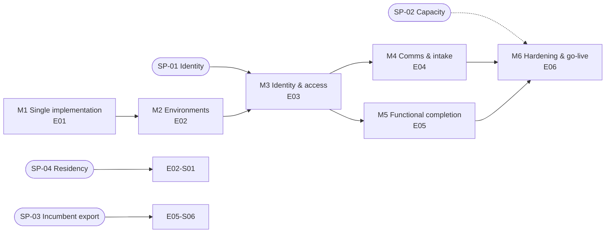

# Roadmap — remaining work to production

> **Current scope authority:** this roadmap's older E03 authentication milestone is superseded by the user-provided `EPIC-AUDITSPHERE-REAL-IMPLEMENTATION.md`, which specifies a no-application-auth trusted-environment profile. Do not implement E03/OIDC/password/session stories from the historical tables below. `docs/product/real-implementation-status.md` is the current 46-story evidence tracker.

Each milestone ends in a **working, deployable state** (CI green, staging deploy healthy). Stories inside a milestone run in the listed order unless marked ∥ (parallel-safe).

## M1 — Single implementation (E01)
*Exit state:* only the BUSINESS workspace remains; all retained suites green; no behaviour change for BUSINESS users.

| Story | Title | Type | Depends |
|---|---|---|---|
| E01-S01 | Tag archive; delete non-runtime prototype artefacts and `ste-audit/` | Cleanup | Owner OK on ADR-0002 |
| E01-S02 | Remove Worker TEST snapshot mode | Cleanup | S01 |
| E01-S03 | Remove legacy browser UI, services, domain, tests; consolidate CSS | Cleanup | S02 |
| E01-S04 | Rename prototype identifiers in code and copy; rewrite README + CLAUDE.md | Docs/Cleanup | S03 |
| E01-S05 | **Conditional:** drop legacy tables and migration tooling | Migration | S04, decision D2 |

## M2 — Environments (E02)
*Exit state:* staging and production environments exist; CI deploys to staging on `main`, production on manual dispatch; deps pinned.

| Story | Title | Type | Depends |
|---|---|---|---|
| E02-S01 | Staging & production Wrangler environments | Infra | M1, SP-04, D5, D6 |
| E02-S02 ∥ | Pin dependency versions exactly | Infra | M1 |
| E02-S03 | Backup/restore runbook and staging drill | Ops | S01 |
| E02-S04 | Fail-closed production readiness checks | Feature | S01 |

## M3 — Identity & access (E03)
*Exit state:* every business request is authenticated; actor comes from the session; clients receive credentials and must reset; admin can manage users. **First milestone where real client data may be entered (after M6 security items P0).**

| Story | Title | Type | Depends |
|---|---|---|---|
| E03-S01 | Auth schema (0046) and `worker/auth` core primitives | Feature | SP-01, ADR-0005 accepted |
| E03-S02 | Staff Entra ID OIDC login, callback, logout, `/me` | Feature | S01 |
| E03-S03 | Session-derived actor in `resolveBusinessContext`; migrate test helpers | Refactor | S02 |
| E03-S04 | Client portal credential provisioning on advance payment (0047) | Feature | S03, E04-S01 for real delivery (can merge with provider stub) |
| E03-S05 | Client login, forced password change gate, reset, lockout | Feature | S04 |
| E03-S06 | Firm admin: invite staff, grants, disable; first-Partner bootstrap CLI | Feature | S03 |
| E03-S07 | Engagement-assignment access scoping (verify-first) | Feature | S03, decision D3 |
| E03-S08 | UI: login screens, own-profile switcher; remove self-selection, setup/connect, header/envelope actor | Feature/Cleanup | S05, S06 |

## M4 — Communications & intake (E04)  ∥ with M5

| Story | Title | Type | Depends |
|---|---|---|---|
| E04-S01 | Production email: sender domain, route-bound recipients, delivery status | Feature | E02-S01 |
| E04-S02 ∥ | Manual WhatsApp / hand-delivery proposal dispatch record (0050) | Feature | M3 |
| E04-S03 ∥ | Public web-form lead intake and triage (0051) | Feature | M3, E06-S02 limiter |
| E04-S04 ∥ | SharePoint: finalise credentials or disable cleanly | Ops | owner action |

## M5 — Functional completion (E05)  ∥ with M4

| Story | Title | Type | Depends |
|---|---|---|---|
| E05-S01 ∥ | *(Optional P2)* Suggested milestone schedule from period end | Feature | M3 |
| E05-S02 ∥ | Workprogram gate matrices (verify-first) | Verify/Feature | M3 |
| E05-S03 ∥ | *(P2)* Going-concern no-forecast UI polish (verify-first) | Feature | M3 |
| E05-S04 ∥ | Client document centre (verify-first) | Verify/Feature | E03-S05 |
| E05-S05 | Large-archive and R2 retention-lock acceptance on staging | Verify | E02-S01 |
| E05-S06 | Bulk client/contact import (0053) | Feature | SP-03 |

## M6 — Hardening & go-live (E06)

| Story | Title | Type | Depends |
|---|---|---|---|
| E06-S01 | Security headers (CSP/HSTS) and ASVS L2 self-assessment | Security | M3 |
| E06-S02 | Rate limiter binding and auth-endpoint limits | Security | E02-S01 |
| E06-S03 | Alert routing for errors, outbox, archive overdue, login abuse | Ops | E02-S01 |
| E06-S04 ∥ | Accessibility audit (WCAG 2.2 AA) and fixes | Quality | E03-S08 |
| E06-S05 | Load test at 50 authenticated sessions | Quality | M3, SP-02 |
| E06-S06 | UAT (E2E-001…005) and go-live runbook | Ops | all |
| E06-S07 ∥ | BUSINESS staged-upload sweep (verify-first) | Feature | M1 |

## Feedback loop (do after every milestone)
1. Update ADRs whose status changed (Proposed → Accepted/Superseded).
2. Update `CLAUDE.md` conventions with anything an agent got wrong twice.
3. Re-check remaining story files against the code; edit ACs that the last milestone made stale.
4. Re-run `docs/product/gap-analysis.md` rows touched by the milestone and flip their status.
